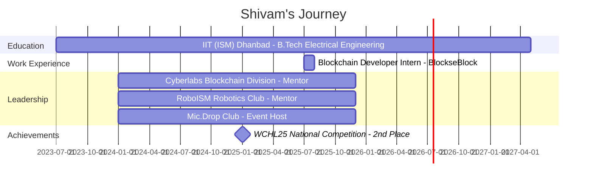

<div align="center">
  
# 👋 Hi, I'm Shivam Arvind Dubey


[](https://www.linkedin.com/in/shivam-arvind-dubey-929100287/)
[](https://github.com/Shivamd0608)
[](mailto:your.email@example.com)

</div>

---

## 🚀 About Me

```javascript
const shivam = {
    location: "Dhanbad, Jharkhand, India 🇮🇳",
    education: "B.Tech Electrical Engineering @ IIT (ISM) Dhanbad",
    role: "Blockchain Developer | Smart Contract Engineer",
    achievement: "🏆 WCHL25 National Champion - 2nd Place (1150+ teams)",
    experience: "Blockchain Developer Intern @ BlockseBlock",
    mentorship: ["Cyberlabs Blockchain Division", "RoboISM Robotics Club"],
    currentFocus: ["DeFi Protocols", "Smart Contract Security", "dApp Architecture"],
    lifePhilosophy: "Building the Decentralized Future, One Block at a Time ⛓️"
};
```

🎓 **B.Tech in Electrical Engineering** at **IIT (ISM) Dhanbad** (Expected May 2027)  
⛓️ **Blockchain Developer Intern** @ **BlockseBlock** | ICPad Platform  
🏆 **WCHL25 National Competition** - **2nd Place** among **1150+ teams**  
👨‍🏫 **Blockchain Mentor** @ **Cyberlabs** | Mentored **30+ students** in Smart Contracts & DeFi  
💻 Specialized in **Solidity**, **DeFi**, **Smart Contract Development**, and **dApp Architecture**  
🌱 Currently building production-ready **DeFi protocols** on **Ethereum** and **Internet Computer**

---

## 🛠️ Tech Stack

<div align="center">

### Languages


### Frontend Development


### Backend Development


### Blockchain & Web3


### Tools & Technologies


</div>

---

## 🌟 Featured Projects

<div align="center">

### 🌿 [GreenXchange](https://github.com/PAVANTEJ-05/GreenXchange)
**Blockchain-Powered Green Credits Trading Platform | WCHL25 Runner-Up**  
Engineered a decentralized marketplace for ERC1155 green credits with on-chain orderbook matching and PYUSD integration. Processed 1,000+ simulated transactions with zero smart contract vulnerabilities, reducing settlement time by 40%.  
`Solidity` `React.js` `TypeScript` `Ethers.js` `OpenZeppelin` `TailwindCSS` `DeFi`

---

### 🔐 [StakingDapp](https://github.com/Shivamd0608/StakingDapp)
**Multi-Pool Ethereum Staking Platform**  
Architected a sophisticated staking contract with configurable APY rates, lock-in durations, and ERC-20 token support. Built responsive Web3 interface with React.js, Vite, and TailwindCSS, enabling secure wallet-based interactions via MetaMask.  
`Solidity` `React.js` `Vite` `TailwindCSS` `Ethers.js` `Remix IDE` `Smart Contracts`

---

### 🚀 [ICPad](https://github.com/SKant03/ICPad)
**Web-Based IDE & Marketplace for Internet Computer | BlockseBlock Internship**  
Developed at BlockseBlock, ICPad is a comprehensive platform for building and deploying dApps on Internet Computer. Implemented core IDE features including file system management, code editing, and canister deployment workflows supporting Motoko and Rust.  
`Internet Computer` `ICP` `Motoko` `Rust` `Web3` `dApp Development`

---

### 🤖 [AI Accelathon Sei](https://github.com/Sumitpalekar/Ai_Accelathon_Sei)
**AI-Powered Blockchain Solution**  
Combining AI and blockchain technology to create innovative solutions for the Sei ecosystem.  
`AI` `Solidity` `Machine Learning` `Blockchain`

</div>

---

## 🏆 Achievements & Leadership

<div align="center">

### 🥈 WCHL25 National Blockchain Competition
**2nd Place Nationally | 1150+ Teams**  
Secured 2nd position in India's premier blockchain hackathon by building an Internet Computer-based decentralized platform evaluated by industry professionals.

---

### 👨‍🏫 Blockchain Mentorship @ Cyberlabs
**Mentored 30+ Students | IIT (ISM) Dhanbad**  
Led structured sessions on Ethereum smart contracts, DeFi fundamentals, and dApp architecture. Reviewed Solidity codebases and guided student-led blockchain projects.

---

### 🤖 RoboISM Robotics & AI Club
**Mentor & Event Coordinator**  
Mentored 30+ students and organized 5+ technical events including RoboWars, focusing on robotics design and system integration.

---

### 🎤 Mic.Drop Public Speaking Club
**Event Host & Coordinator**  
Hosted 4+ public speaking events, enhancing participant engagement and fostering technical communication skills.

</div>

---

## 💼 Professional Experience Timeline



---

## 📊 GitHub Stats

<div align="center">
  


</div>

<div align="center">
  


</div>

---

## 🏅 GitHub Achievements

<div align="center">

**Pull Shark x2** • **Quickdraw** • **YOLO**

*Earned through consistent contributions and rapid issue responses*

</div>

---

## 🔥 Contribution Graph

<div align="center">

[](https://github.com/ashutosh00710/github-readme-activity-graph)

</div>

---

## 📈 Profile Views & Metrics

<div align="center">


</div>

---

## 💼 Professional Experience & Current Focus

- 💼 **Blockchain Developer Intern @ BlockseBlock** (July 2025 - August 2025)
  - Contributed to ICPad development - Web-based IDE for Internet Computer dApps
  - Implemented file system management, code editing, and canister deployment workflows
  - Integrated Internet Identity for secure authentication and built user dashboard

- 🌱 Exploring **Solana**, **Layer 2 scaling solutions**, and **zkSync**
- 🔭 Building production-ready **DeFi protocols** with advanced **Smart Contract Security**
- 👯 Open to collaborate on **Web3 projects**, **DeFi protocols**, and **Open Source**
- 💬 Ask me about **Solidity, Smart Contracts, DeFi, React, Node.js, Blockchain Architecture**
- ⚡ Fun fact: I mentor **30+ students** in blockchain while building **award-winning dApps**!

---

## 🤝 Connect With Me

<div align="center">

[](https://www.linkedin.com/in/shivam-arvind-dubey-929100287/)
[](https://twitter.com/yourhandle)
[](https://discord.gg/yourserver)
[](https://t.me/yourhandle)

</div>

---

<div align="center">

### 💭 Quote of the Day


---

### 🎯 2025 Goals

✅ Contribute to **10+ Open Source** blockchain projects  
✅ Launch **3+ production-ready DApps** on mainnet  
✅ Master **Smart Contract Security** and **Auditing**  
✅ Expand **Internet Computer** and **Solana** expertise  
✅ Mentor **50+ students** in Web3 development  
✅ Achieve **top rankings** in major blockchain hackathons

---


**⭐️ From [Shivamd0608](https://github.com/Shivamd0608) | Let's Build the Future Together! 🚀**

</div>
